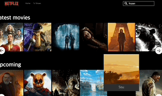
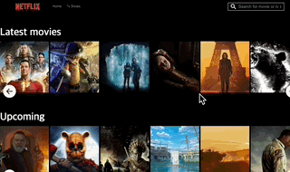
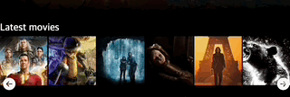

## 설명

> `https://api.themoviedb.org/` REST API 를 이용한 넷플릭스 클론코딩

[Demo](https://hwisaac.github.io/react-chal6/)

## 구현

영화 정보 모달창 

검색하기 + 무한쿼리

슬라이드 구현

## 사용

- `react` 사용자 인터페이스 구축
- `framer-motion` 애니메이션
- `react-query` 비동기 데이터 요청 및 데이터 상태 관리
- `react-hook-form` 폼 관리 및 유효성 검사
- `react-icons` 아이콘 사용
- `typescript` 정적 타입 적용
